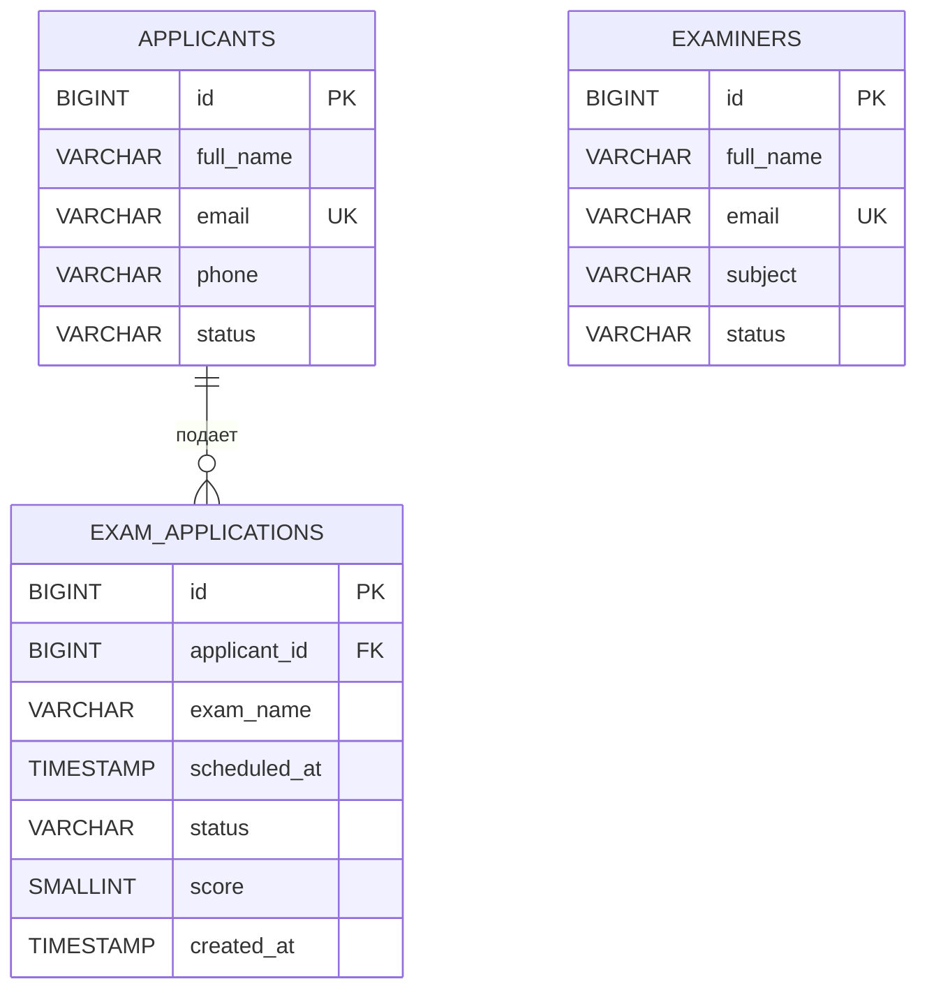

# ER диаграмма экзаменационного центра

Один кандидат может подать несколько заявок. Каждая заявка принадлежит ровно одному кандидату. Внешний ключ `exam_applications.applicant_id` указывает на `applicants.id`.

`examiners` — отдельный справочник экзаменаторов. Для него реализованы собственные CRUD, фильтры и сортировка; назначение экзаменатора на заявку пока не является частью модели КР 1.
