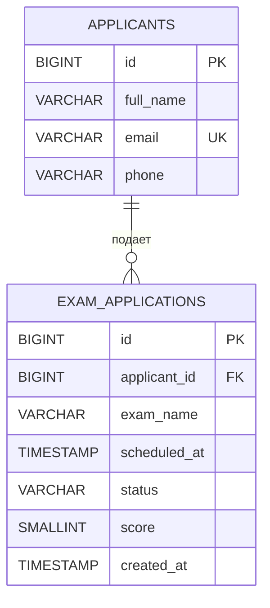

# ER диаграмма экзаменационного центра

Один кандидат может подать несколько заявок. Каждая заявка принадлежит ровно одному кандидату. Внешний ключ `exam_applications.applicant_id` указывает на `applicants.id`.
